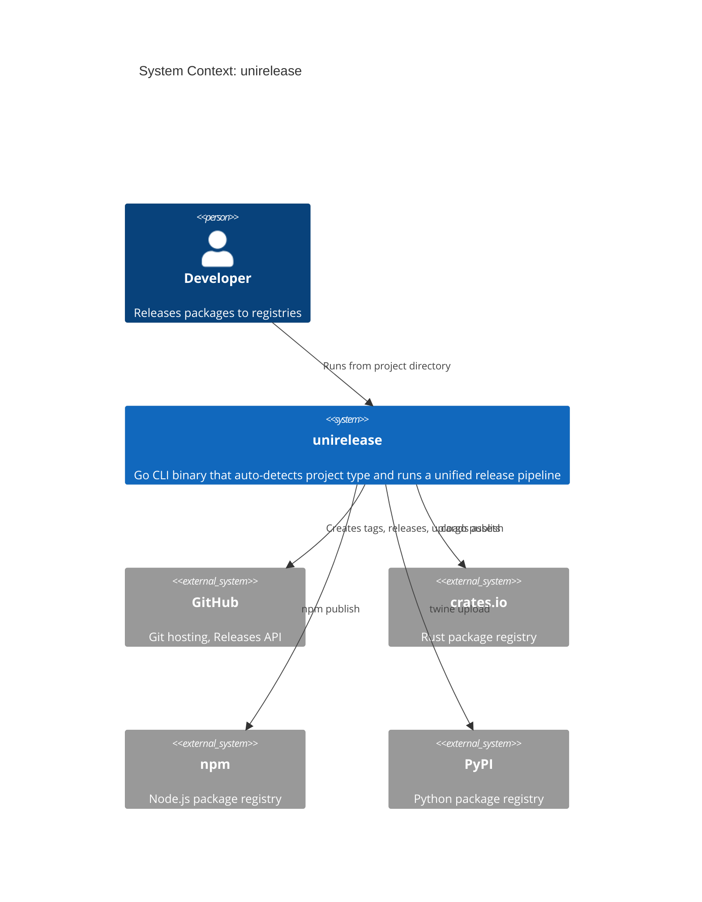
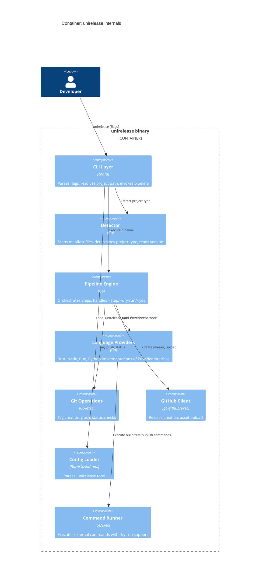
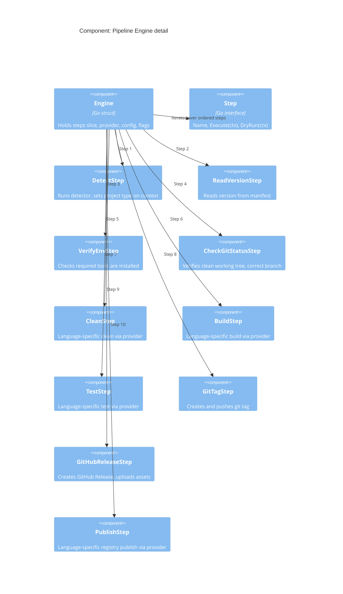
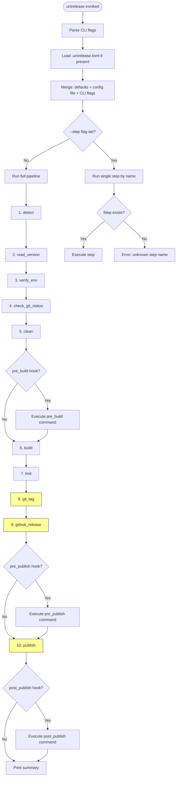
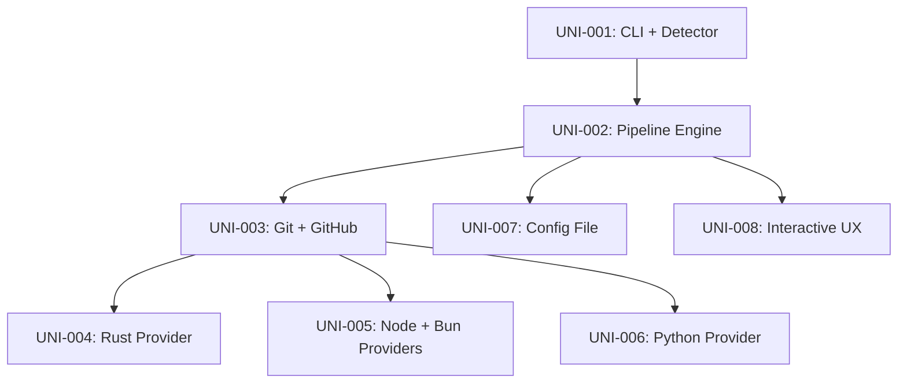

# Technical Design: unirelease

| Field            | Value                                                        |
|------------------|--------------------------------------------------------------|
| **Status**       | Draft                                                        |
| **Author**       | Architecture Team                                            |
| **Created**      | 2026-03-21                                                   |
| **Upstream**     | [Idea Draft](../../ideas/unirelease/draft.md), [Decomposition](../decomposition.md) |
| **Language**     | Go 1.22+                                                     |
| **Components**   | 8 (UNI-001 through UNI-008)                                  |

---

## 1. Overview

### 1.1 Problem Statement

Three separate bash release scripts (TypeScript 543 lines, Rust 393 lines, Python ~500 lines) implement the same release flow -- version verification, git status checks, clean, build, test, git tag, GitHub Release creation, and registry publish -- but are duplicated per language with divergent shell syntax. They do not work on Windows, they cannot be tested in isolation, and adding a new language requires cloning and modifying an entire script.

### 1.2 Proposed Solution

A single Go binary (`unirelease`) that auto-detects project type from manifest files (Cargo.toml, package.json, pyproject.toml), reads the version, and executes a unified release pipeline. Language-specific behavior is encapsulated behind a `Provider` interface. Shared steps (git operations, GitHub Release creation) are implemented once. The pipeline supports `--step` filtering, `--dry-run` preview, `--yes` non-interactive mode, and optional `.unirelease.toml` configuration.

### 1.3 Goals

1. Replace all 3 existing release scripts with a single cross-platform binary.
2. Auto-detect project type with zero configuration required.
3. Support Rust, Node, Bun-binary, and Python release workflows.
4. Provide `--dry-run` mode that previews the entire pipeline without side effects.
5. Work on macOS, Linux, and Windows without modification.

### 1.4 Non-Goals

- Plugin system for custom project types.
- Monorepo multi-package releases.
- Changelog generation.
- Semantic version bumping (version must already be set in source).
- CI/CD mode with special output formatting.
- Interactive version selection.

---

## 2. Architecture

### 2.1 System Context (C4 Level 1)



### 2.2 Container Diagram (C4 Level 2)



### 2.3 Component Diagram (C4 Level 3)



### 2.4 Go Module Structure

```
unirelease/
  go.mod
  go.sum
  main.go                          # Entry point: calls cmd.Execute()
  cmd/
    root.go                        # Cobra root command, flag definitions
  internal/
    detector/
      detector.go                  # ProjectType detection logic
      detector_test.go
      version.go                   # Version reading from manifests
      version_test.go
    pipeline/
      engine.go                    # Pipeline orchestration
      engine_test.go
      step.go                      # Step interface
      context.go                   # PipelineContext (shared state)
      steps/
        detect.go                  # DetectStep
        version.go                 # ReadVersionStep
        verify_env.go              # VerifyEnvStep
        git_status.go              # CheckGitStatusStep
        clean.go                   # CleanStep (delegates to provider)
        build.go                   # BuildStep (delegates to provider)
        test.go                    # TestStep (delegates to provider)
        git_tag.go                 # GitTagStep
        github_release.go          # GitHubReleaseStep
        publish.go                 # PublishStep (delegates to provider)
    providers/
      provider.go                  # Provider interface definition
      rust.go                      # Rust provider
      rust_test.go
      node.go                      # Node provider
      node_test.go
      bun.go                       # Bun-binary provider
      bun_test.go
      python.go                    # Python provider
      python_test.go
    git/
      git.go                       # Git operations (tag, push, status, branch)
      git_test.go
    github/
      client.go                    # GitHub Release creation, asset upload
      client_test.go
    config/
      config.go                    # .unirelease.toml parsing and merging
      config_test.go
    runner/
      runner.go                    # Command execution with dry-run support
      runner_test.go
    ui/
      ui.go                        # Colored output, progress display, prompts
      ui_test.go
```

---

## 3. Design Inputs

### 3.1 Functional Requirements

| ID      | Requirement                                                                                          | Source     |
|---------|------------------------------------------------------------------------------------------------------|------------|
| FR-001  | Auto-detect project type from manifest files in the working directory                                | Idea Draft |
| FR-002  | Read version from package.json (`.version`), Cargo.toml (`[package] version`), pyproject.toml (`[project] version`) | Idea Draft |
| FR-003  | Execute a 10-step pipeline: detect, read_version, verify_env, check_git_status, clean, build, test, git_tag, github_release, publish | Idea Draft |
| FR-004  | Support `--step <name>` to run only a specific pipeline step                                         | Idea Draft |
| FR-005  | Support `--dry-run` to preview all steps without executing side effects                              | Idea Draft |
| FR-006  | Support `--yes` / `-y` to skip all interactive confirmations                                         | Idea Draft |
| FR-007  | Support `--version <ver>` to override detected version                                               | Idea Draft |
| FR-008  | Support `--type <type>` to override auto-detection                                                   | Idea Draft |
| FR-009  | Create and push annotated git tags with configurable prefix (default `v`)                            | Idea Draft |
| FR-010  | Create GitHub Releases via API with release notes                                                    | Idea Draft |
| FR-011  | Upload binary assets to GitHub Releases for bun-binary projects                                      | Idea Draft |
| FR-012  | Publish to crates.io via `cargo publish`                                                             | Idea Draft |
| FR-013  | Publish to npm via `npm publish --access public`                                                     | Idea Draft |
| FR-014  | Publish to PyPI via `twine upload`                                                                   | Idea Draft |
| FR-015  | Parse optional `.unirelease.toml` for type override, tag_prefix, skip steps, hooks, command overrides| Idea Draft |
| FR-016  | Detect package manager from lockfile presence (pnpm-lock.yaml, package-lock.json, yarn.lock, bun.lockb) | Decomposition |
| FR-017  | Detect bun-binary projects by presence of `bun build --compile` in package.json scripts              | Idea Draft |
| FR-018  | Display confirmation prompts before destructive steps (tag, publish); skip with `--yes`              | Idea Draft |

### 3.2 Non-Functional Requirements

| ID       | Requirement                                                                              |
|----------|------------------------------------------------------------------------------------------|
| NFR-001  | Cross-platform: macOS, Linux, Windows without modification                               |
| NFR-002  | Single statically-linked binary, no runtime dependencies beyond the language toolchains  |
| NFR-003  | Pipeline execution completes within the time of the underlying build/publish commands (no measurable overhead) |
| NFR-004  | Colored terminal output with graceful degradation on non-TTY (e.g., CI pipes)            |
| NFR-005  | Clear error messages when required tools are missing (e.g., `cargo not found`)           |
| NFR-006  | Zero configuration required for standard project layouts                                 |

### 3.3 Detection Priority Rules

When multiple manifest files exist (e.g., Cargo.toml + package.json in wasm-pack projects), detection follows this priority order:

1. Cargo.toml -> Rust
2. pyproject.toml -> Python
3. package.json with `bun build --compile` in scripts -> Bun-binary
4. package.json (normal) -> Node

The `--type` flag overrides this entirely.

### 3.4 Package Manager Detection (Node)

| Lockfile Present     | Package Manager |
|----------------------|-----------------|
| pnpm-lock.yaml       | pnpm            |
| bun.lockb            | bun             |
| yarn.lock            | yarn            |
| package-lock.json    | npm             |
| (none)               | npm (default)   |

### 3.5 User Scenarios

**Scenario 1: Rust crate release.**
A developer runs `unirelease` in a directory containing Cargo.toml with `version = "0.3.0"`. The tool detects Rust, reads version 0.3.0, verifies `cargo` and `rustc` are installed, checks git status is clean, runs `cargo clean`, `cargo build --release`, `cargo test`, creates git tag `v0.3.0`, creates a GitHub Release titled "Release 0.3.0", and runs `cargo publish`. Each destructive step prompts for confirmation.

**Scenario 2: Bun binary release.**
A developer runs `unirelease` in a directory with package.json containing `"build": "bun build --compile src/index.ts --outfile dist/myapp"`. The tool detects bun-binary, builds the binary, creates a GitHub Release, and uploads the compiled binary as a release asset. No npm publish occurs.

**Scenario 3: Node package release.**
A developer runs `unirelease` in a directory with package.json (no `bun build --compile`). The tool detects Node, determines package manager from lockfile (pnpm-lock.yaml -> pnpm), builds with `pnpm build`, tests with `pnpm test`, creates git tag and GitHub Release, and publishes with `npm publish --access public`.

**Scenario 4: Python package release.**
A developer runs `unirelease` in a directory with pyproject.toml. The tool detects Python, reads version from `[project] version`, verifies `python`, `twine` are available, cleans dist/, builds with `python -m build`, runs `pytest`, creates git tag and GitHub Release, and uploads with `twine upload dist/*`.

**Scenario 5: Dry run preview.**
A developer runs `unirelease --dry-run`. The tool prints each step with the command that would execute, without running anything. Output shows: "Would run: cargo build --release", "Would create tag: v0.3.0", etc.

**Scenario 6: Single step execution.**
A developer runs `unirelease --step build` to re-run only the build step after fixing a compile error, without re-running the full pipeline.

### 3.6 Acceptance Criteria

| ID     | Criterion                                                                                        |
|--------|--------------------------------------------------------------------------------------------------|
| AC-001 | `unirelease` in a Rust project dir: detects Cargo.toml, reads version, builds, tags, publishes to crates.io |
| AC-002 | `unirelease` in a Bun binary project: detects bun build --compile, builds binary, creates GitHub Release with uploaded binary |
| AC-003 | `unirelease` in a Node project: detects package.json, builds, publishes to npm                   |
| AC-004 | `unirelease` in a Python project: detects pyproject.toml, builds, publishes to PyPI              |
| AC-005 | `unirelease --dry-run` shows full plan without executing anything                                |
| AC-006 | Works on macOS, Linux, and Windows without modification                                          |
| AC-007 | `--step build` runs only the build step                                                          |
| AC-008 | `--yes` skips all confirmation prompts                                                           |
| AC-009 | `--version 1.2.3` overrides detected version                                                    |
| AC-010 | `--type rust` overrides auto-detection                                                           |
| AC-011 | `.unirelease.toml` with `skip = ["test"]` skips the test step                                   |
| AC-012 | `.unirelease.toml` with `[hooks] pre_build = "make generate"` runs the hook before build         |

### 3.7 Success Metrics

| Metric                          | Target                                                     |
|---------------------------------|------------------------------------------------------------|
| Script replacement              | All 3 existing bash scripts (~1,500 lines) replaced by single binary |
| Language coverage                | 4 project types (Rust, Node, Bun-binary, Python) supported |
| Platform coverage                | macOS, Linux, Windows binaries via `go build`              |
| Zero-config success rate         | Standard project layouts release without any config file   |
| Dry-run accuracy                 | `--dry-run` output exactly matches what full run executes  |

---

## 4. Solution Alternatives

### 4.1 Alternative A: Pure Go with os/exec (Recommended)

Execute all external tools (cargo, pnpm, npm, python, twine, git, gh) via `os/exec.Command`. GitHub Releases created via the `google/go-github` library using the GitHub REST API directly. Configuration parsed with `BurntSushi/toml`. CLI built with `spf13/cobra`.

**Pros:**
- Single binary, no runtime dependencies.
- Full control over command execution, output capture, and error handling.
- `go-github` provides typed GitHub API access with proper error handling.
- Well-tested, widely-used Go libraries.

**Cons:**
- Must shell out for every language tool (cargo, pnpm, twine).
- `go-github` adds a dependency for something `gh` CLI can also do.

### 4.2 Alternative B: Pure Go with gh CLI for GitHub operations

Same as Alternative A, but use `gh release create` (shelling out to `gh` CLI) instead of `go-github` library for GitHub Releases.

**Pros:**
- No `go-github` dependency.
- `gh` handles authentication complexity (browser login, token management).
- Simpler implementation for release creation.

**Cons:**
- Requires `gh` CLI installed on the machine (additional runtime dependency).
- Less control over error handling (must parse CLI output).
- Cannot upload assets programmatically as easily.

### 4.3 Alternative C: Embedded scripting (Go + embedded bash/Lua)

Embed language-specific scripts as Go templates or Lua scripts. The Go binary acts as a runner that fills in variables and executes embedded scripts.

**Pros:**
- Easier to port existing bash scripts directly.
- Language-specific logic stays in a scripting language.

**Cons:**
- Defeats the purpose of replacing bash scripts.
- Does not solve Windows compatibility.
- Adds complexity (template engine or Lua runtime).
- Harder to test.

### 4.4 Comparison Matrix

| Criterion                  | A: Pure Go + go-github | B: Pure Go + gh CLI | C: Embedded scripting |
|----------------------------|:----------------------:|:-------------------:|:---------------------:|
| Single binary, no deps     | Yes                    | No (needs gh)       | Partial               |
| Windows support             | Full                   | Full (if gh exists) | Poor                  |
| GitHub auth handling        | Manual (token env var) | Automatic (gh auth) | Manual                |
| Asset upload support        | Native (API)           | Via gh CLI           | Manual                |
| Implementation complexity   | Medium                 | Low                  | High                  |
| Testability                 | High (mock interfaces) | Medium               | Low                   |
| Error handling quality      | High (typed errors)    | Medium (string parse)| Low                   |

### 4.5 Decision

**Alternative A (Pure Go + go-github)** with a **fallback to gh CLI** for authentication convenience.

Rationale:
- Primary path: Use `GITHUB_TOKEN` env var with `go-github` library for programmatic API access, typed errors, and native asset upload.
- Fallback path: If `GITHUB_TOKEN` is not set, check if `gh auth token` can provide a token. If neither is available, print clear instructions (matching the pattern from the existing Python release script's `get_github_token()` function).
- This gives the best of both worlds: no mandatory `gh` dependency, but seamless auth when `gh` is installed.

---

## 5. Core Interface Definitions

### 5.1 Provider Interface

```go
// Provider defines the contract for language-specific release operations.
// Each language (Rust, Node, Bun, Python) implements this interface.
type Provider interface {
    // Name returns the provider identifier (e.g., "rust", "node", "bun", "python").
    Name() string

    // Detect checks whether the given project directory matches this provider.
    // Returns true if the provider can handle this project, along with a confidence
    // score (higher wins when multiple providers match).
    Detect(projectDir string) (bool, int)

    // ReadVersion extracts the current version string from the project manifest.
    // Returns the version (e.g., "1.2.3") or an error if the manifest is
    // missing or the version field cannot be parsed.
    ReadVersion(projectDir string) (string, error)

    // VerifyEnv checks that all required tools are installed and accessible
    // in PATH. Returns a list of missing tools, or nil if everything is present.
    // Example: Rust provider checks for "cargo" and "rustc".
    VerifyEnv() ([]string, error)

    // Clean removes build artifacts. Language-specific:
    //   Rust: cargo clean
    //   Node: rm -rf dist/ node_modules/.cache/
    //   Python: rm -rf dist/ build/ *.egg-info/
    Clean(ctx *PipelineContext) error

    // Build compiles or packages the project. Language-specific:
    //   Rust: cargo build --release
    //   Node: pnpm build (or detected package manager)
    //   Bun: bun run build
    //   Python: python -m build
    Build(ctx *PipelineContext) error

    // Test runs the project test suite. Language-specific:
    //   Rust: cargo test
    //   Node: pnpm test
    //   Python: pytest
    Test(ctx *PipelineContext) error

    // Publish pushes the built artifact to the language registry.
    //   Rust: cargo publish
    //   Node: npm publish --access public
    //   Bun: (no registry publish; asset upload handled by GitHubReleaseStep)
    //   Python: twine upload dist/*
    // Returns ErrNoPublish if this provider does not publish to a registry
    // (e.g., bun-binary uploads to GitHub Release instead).
    Publish(ctx *PipelineContext) error

    // PublishTarget returns a human-readable description of where this provider
    // publishes (e.g., "crates.io", "npm", "PyPI", "GitHub Release").
    PublishTarget() string

    // BinaryAssets returns file paths of binary assets to upload to GitHub Release.
    // Returns nil for providers that publish to a package registry instead.
    // Only bun-binary provider returns non-nil.
    BinaryAssets(ctx *PipelineContext) ([]string, error)
}
```

### 5.2 PipelineContext

```go
// PipelineContext carries shared state through the pipeline.
type PipelineContext struct {
    // ProjectDir is the absolute path to the project root.
    ProjectDir string

    // ProjectType is the detected (or overridden) project type.
    ProjectType string // "rust" | "node" | "bun" | "python"

    // Version is the resolved version string (from manifest or --version override).
    Version string

    // TagName is the formatted git tag (e.g., "v1.2.3").
    TagName string

    // Provider is the resolved language provider.
    Provider Provider

    // Config is the merged configuration (defaults + .unirelease.toml + CLI flags).
    Config *Config

    // DryRun indicates whether to preview without executing.
    DryRun bool

    // Yes indicates whether to skip confirmation prompts.
    Yes bool

    // Step, if non-empty, restricts execution to this single step name.
    Step string

    // Runner executes external commands (supports dry-run mode).
    Runner *Runner

    // UI handles colored output and prompts.
    UI *UI

    // GitHubRepo is the "owner/repo" string extracted from git remote.
    GitHubRepo string

    // GitHubToken is the resolved GitHub API token (from env, gh CLI, or git config).
    GitHubToken string
}
```

### 5.3 Step Interface

```go
// Step represents a single pipeline step.
type Step interface {
    // Name returns the step identifier used for --step filtering and display.
    // Must be one of: "detect", "read_version", "verify_env", "check_git_status",
    // "clean", "build", "test", "git_tag", "github_release", "publish".
    Name() string

    // Description returns a human-readable description for progress display.
    Description() string

    // Execute runs the step. Returns an error if the step fails.
    Execute(ctx *PipelineContext) error

    // DryRun prints what the step would do without executing.
    DryRun(ctx *PipelineContext) error

    // Destructive returns true if this step modifies external state
    // (git tag, publish, GitHub release) and should prompt for confirmation
    // when not in --yes mode.
    Destructive() bool
}
```

### 5.4 Config struct

```go
// Config represents the merged configuration from .unirelease.toml and CLI flags.
type Config struct {
    // Type overrides auto-detection. Empty string means auto-detect.
    Type string `toml:"type"`

    // TagPrefix is prepended to the version for git tags. Default: "v".
    TagPrefix string `toml:"tag_prefix"`

    // Skip lists step names to skip during pipeline execution.
    Skip []string `toml:"skip"`

    // Hooks defines pre/post hooks for pipeline steps.
    Hooks HooksConfig `toml:"hooks"`

    // Commands overrides default build/test commands.
    Commands CommandsConfig `toml:"commands"`
}

// HooksConfig defines hook commands.
type HooksConfig struct {
    PreBuild    string `toml:"pre_build"`
    PostBuild   string `toml:"post_build"`
    PrePublish  string `toml:"pre_publish"`
    PostPublish string `toml:"post_publish"`
}

// CommandsConfig overrides default commands.
type CommandsConfig struct {
    Build string `toml:"build"`
    Test  string `toml:"test"`
    Clean string `toml:"clean"`
}
```

### 5.5 Runner (Command Execution)

```go
// Runner executes external commands with dry-run and output capture support.
type Runner struct {
    DryRun bool
    Dir    string // Working directory for commands
    UI     *UI
}

// Run executes a command. In dry-run mode, it prints the command without executing.
// Args: name is the executable, args are the arguments.
// Returns combined stdout+stderr output and any error.
func (r *Runner) Run(name string, args ...string) (string, error)

// RunSilent executes a command without printing output (for checks/queries).
func (r *Runner) RunSilent(name string, args ...string) (string, error)

// CommandExists checks if an executable is in PATH.
func (r *Runner) CommandExists(name string) bool
```

---

## 6. Pipeline Orchestration

### 6.1 Pipeline Flow



Steps marked yellow (git_tag, github_release, publish) are destructive and prompt for confirmation unless `--yes` is set.

### 6.2 Step Skip Logic

A step is skipped if ANY of these conditions is true:
1. The step name is in `Config.Skip[]`.
2. `--step <name>` is set and this is not the named step.
3. The step's `Execute()` method determines it is not applicable (e.g., PublishStep with bun-binary returns `ErrNoPublish`, which the engine treats as a skip, not an error).

### 6.3 Dry-Run Behavior

When `--dry-run` is true:
1. The engine calls `step.DryRun(ctx)` instead of `step.Execute(ctx)`.
2. `Runner.Run()` prints `[dry-run] Would run: <command>` and returns empty output with nil error.
3. Destructive steps print their intent: `[dry-run] Would create tag: v1.2.3`.
4. The full pipeline runs end-to-end in dry-run mode (all 10 steps), so the developer sees the complete plan.

### 6.4 Confirmation Prompts

For steps where `Destructive()` returns true (git_tag, github_release, publish):
1. If `--yes` is set, skip the prompt and proceed.
2. If `--dry-run` is set, no prompt needed (nothing executes).
3. Otherwise, display: `About to <step description>. Continue? [Y/n]` and wait for input.
4. On non-TTY stdin (pipe/CI), default to "no" and print a warning suggesting `--yes`.

---

## 7. Provider Implementations

### 7.1 Rust Provider

| Method       | Implementation                                                                          |
|--------------|-----------------------------------------------------------------------------------------|
| Detect       | Check `Cargo.toml` exists in project dir. Confidence: 100.                              |
| ReadVersion  | Parse Cargo.toml, extract `[package] version = "X.Y.Z"` using a TOML parser.           |
| VerifyEnv    | Check `cargo` and `rustc` in PATH.                                                     |
| Clean        | `cargo clean`                                                                           |
| Build        | `cargo build --release`                                                                 |
| Test         | `cargo test`                                                                            |
| Publish      | `cargo publish`                                                                         |
| PublishTarget| `"crates.io"`                                                                           |
| BinaryAssets | `nil` (publishes to registry, not GitHub Release)                                       |

### 7.2 Node Provider

| Method       | Implementation                                                                          |
|--------------|-----------------------------------------------------------------------------------------|
| Detect       | Check `package.json` exists AND no `bun build --compile` in scripts. Confidence: 50.    |
| ReadVersion  | Parse package.json, extract `.version` field using `encoding/json`.                     |
| VerifyEnv    | Check detected package manager (pnpm/npm/yarn/bun) in PATH. Check `npm` for publish.   |
| Clean        | `rm -rf dist/ node_modules/.cache/` (cross-platform via Go `os.RemoveAll`)              |
| Build        | `<pkg-manager> build` (pnpm build, npm run build, yarn build, bun run build)            |
| Test         | `<pkg-manager> test`                                                                    |
| Publish      | `npm publish --access public`                                                           |
| PublishTarget| `"npm"`                                                                                 |
| BinaryAssets | `nil`                                                                                   |

**Package manager detection**: Scan lockfiles in priority order: pnpm-lock.yaml -> bun.lockb -> yarn.lock -> package-lock.json -> default npm.

### 7.3 Bun-Binary Provider

| Method       | Implementation                                                                          |
|--------------|-----------------------------------------------------------------------------------------|
| Detect       | Check `package.json` exists AND at least one script value contains `bun build --compile`. Confidence: 80. |
| ReadVersion  | Parse package.json, extract `.version` field.                                           |
| VerifyEnv    | Check `bun` in PATH.                                                                   |
| Clean        | `rm -rf dist/` via Go `os.RemoveAll`                                                   |
| Build        | `bun run build`                                                                         |
| Test         | `bun test`                                                                              |
| Publish      | Return `ErrNoPublish` (bun-binary projects do not publish to a registry).               |
| PublishTarget| `"GitHub Release"`                                                                      |
| BinaryAssets | Return path to compiled binary (parsed from `--outfile` in the build script, or `dist/` scan). |

### 7.4 Python Provider

| Method       | Implementation                                                                          |
|--------------|-----------------------------------------------------------------------------------------|
| Detect       | Check `pyproject.toml` exists. Confidence: 90.                                          |
| ReadVersion  | Parse pyproject.toml, extract `[project] version = "X.Y.Z"` using TOML parser.         |
| VerifyEnv    | Check `python` (or `python3`), `twine` in PATH. Warn if `build` module unavailable.    |
| Clean        | `rm -rf dist/ build/ *.egg-info/` via Go `os.RemoveAll` + glob                         |
| Build        | `python -m build`                                                                       |
| Test         | `pytest` (if present in PATH) or `python -m pytest`                                    |
| Publish      | `twine upload dist/*`                                                                   |
| PublishTarget| `"PyPI"`                                                                                |
| BinaryAssets | `nil`                                                                                   |

---

## 8. Component Overview

### 8.1 Components and Feature Mapping

| Component                     | Feature ID | Feature Spec                                                 |
|-------------------------------|------------|--------------------------------------------------------------|
| CLI Shell + Project Detector  | UNI-001    | [docs/features/cli-detector.md](../features/cli-detector.md) |
| Pipeline Engine               | UNI-002    | [docs/features/pipeline-engine.md](../features/pipeline-engine.md) |
| Git + GitHub Operations       | UNI-003    | [docs/features/git-github.md](../features/git-github.md)     |
| Rust Provider                 | UNI-004    | [docs/features/rust-provider.md](../features/rust-provider.md) |
| Node + Bun-Binary Providers   | UNI-005    | [docs/features/node-bun-provider.md](../features/node-bun-provider.md) |
| Python Provider               | UNI-006    | [docs/features/python-provider.md](../features/python-provider.md) |
| Config File Support           | UNI-007    | [docs/features/config-file.md](../features/config-file.md)   |
| Interactive Prompts + UX      | UNI-008    | [docs/features/interactive-ux.md](../features/interactive-ux.md) |

### 8.2 Dependency Graph



### 8.3 Phased Delivery

| Phase | Sprint | Features                          | Deliverable                                  |
|-------|--------|-----------------------------------|----------------------------------------------|
| 1     | 1      | UNI-001, UNI-002                  | `unirelease --dry-run` detects and prints plan |
| 1     | 2      | UNI-003, UNI-004                  | Full Rust release end-to-end                 |
| 2     | 3      | UNI-005, UNI-006                  | All 4 language types supported               |
| 3     | 4      | UNI-007, UNI-008                  | Config overrides + interactive prompts       |

---

## 9. Git + GitHub Operations

### 9.1 Git Operations (internal/git/)

```go
// Status checks if the working tree is clean (no uncommitted changes).
func Status(dir string) (clean bool, output string, err error)

// CurrentBranch returns the current git branch name.
func CurrentBranch(dir string) (string, error)

// TagExists checks if a tag exists locally.
func TagExists(dir string, tag string) bool

// TagExistsOnRemote checks if a tag exists on the remote.
func TagExistsOnRemote(dir string, tag string) (bool, error)

// CreateTag creates an annotated git tag.
func CreateTag(dir string, tag string, message string) error

// PushTag pushes a tag to the remote.
func PushTag(dir string, tag string) error

// RemoteURL returns the origin remote URL.
func RemoteURL(dir string) (string, error)

// ParseGitHubRepo extracts "owner/repo" from a GitHub remote URL.
// Handles both SSH (git@github.com:owner/repo.git) and HTTPS
// (https://github.com/owner/repo.git) formats.
func ParseGitHubRepo(remoteURL string) (string, error)
```

### 9.2 GitHub Client (internal/github/)

```go
// Client wraps GitHub API operations.
type Client struct {
    Token string
    Repo  string // "owner/repo"
}

// ResolveToken attempts to find a GitHub token from:
// 1. GITHUB_TOKEN environment variable
// 2. gh auth token (if gh CLI is installed and authenticated)
// 3. git config github.token
// Returns the token and source description, or error if none found.
func ResolveToken() (token string, source string, err error)

// ReleaseExists checks if a release for the given tag already exists.
func (c *Client) ReleaseExists(tag string) (bool, error)

// CreateRelease creates a GitHub Release for the given tag.
// releaseNotes is the markdown body.
func (c *Client) CreateRelease(tag string, title string, releaseNotes string) (releaseID int64, err error)

// UploadAsset uploads a file as a release asset.
func (c *Client) UploadAsset(releaseID int64, filePath string) error
```

---

## 10. Error Handling Strategy

### 10.1 Error Categories

| Category          | Example                                      | Behavior                                |
|-------------------|----------------------------------------------|-----------------------------------------|
| Detection failure | No manifest file found                       | Print supported types, exit code 1      |
| Missing tool      | `cargo` not in PATH                          | Print install instructions, exit code 1 |
| Build failure     | `cargo build --release` exits non-zero       | Print stderr, exit code from subprocess |
| Git dirty         | Uncommitted changes                          | Warn, prompt to continue or abort       |
| Tag exists        | Tag already on remote                        | Warn, prompt to overwrite or skip       |
| Auth missing      | No GitHub token found                        | Print 3 resolution options, skip step   |
| Publish failure   | npm publish fails (version exists)           | Print error, exit code 1                |
| Config parse      | Invalid .unirelease.toml                     | Print parse error with line number, exit code 1 |

### 10.2 Exit Codes

| Code | Meaning                                    |
|------|--------------------------------------------|
| 0    | Success                                    |
| 1    | General failure (build, test, publish)     |
| 2    | Invalid arguments or configuration         |
| 3    | Detection failure (no supported project)   |
| 4    | Missing required tool                      |

### 10.3 Error Wrapping

All errors use `fmt.Errorf("step %s: %w", stepName, err)` to provide context chain. The top-level CLI handler unwraps errors for display and maps to exit codes.

---

## 11. Dependencies

| Dependency                    | Version  | Purpose                                  |
|-------------------------------|----------|------------------------------------------|
| `github.com/spf13/cobra`     | v1.8+    | CLI framework, flag parsing              |
| `github.com/BurntSushi/toml` | v1.3+    | TOML parsing for Cargo.toml, pyproject.toml, .unirelease.toml |
| `github.com/google/go-github/v60` | v60+ | GitHub Releases API, asset upload        |
| `golang.org/x/oauth2`        | latest   | GitHub API authentication                |
| `github.com/fatih/color`     | v1.16+   | Cross-platform colored terminal output   |
| `golang.org/x/term`          | latest   | TTY detection for prompt logic           |

No additional runtime dependencies. The binary is self-contained.

---

## 12. Cross-Platform Considerations

### 12.1 File Operations

- Use `filepath.Join()` for all path construction (never hardcode `/`).
- Use `os.RemoveAll()` for clean operations instead of `rm -rf`.
- Use `filepath.Glob()` for wildcard patterns (e.g., `dist/*.whl`).

### 12.2 Command Execution

- Use `exec.Command()` which handles platform-specific executable resolution.
- On Windows, `cargo`, `npm`, `python` may need `.cmd`/`.exe` suffixes -- `exec.LookPath()` handles this automatically.
- Avoid shell-specific features: no `|`, `&&`, backticks. Each command is a direct exec.

### 12.3 Terminal

- Use `github.com/fatih/color` which auto-detects Windows console capabilities and disables colors when not supported.
- Use `golang.org/x/term.IsTerminal()` to detect TTY for prompt logic.
- On non-TTY (CI), default `--yes` behavior: skip prompts, proceed automatically.

### 12.4 Build Matrix

```
GOOS=darwin  GOARCH=amd64  -> unirelease-darwin-amd64
GOOS=darwin  GOARCH=arm64  -> unirelease-darwin-arm64
GOOS=linux   GOARCH=amd64  -> unirelease-linux-amd64
GOOS=linux   GOARCH=arm64  -> unirelease-linux-arm64
GOOS=windows GOARCH=amd64  -> unirelease-windows-amd64.exe
```

---

## 13. Testing Strategy

### 13.1 Unit Tests

- **Detector tests**: Create temp dirs with various manifest files, verify correct detection and version reading.
- **Provider tests**: Mock the Runner interface, verify correct commands are constructed for each provider method.
- **Config tests**: Parse various `.unirelease.toml` files, verify merge with defaults and CLI overrides.
- **Git tests**: Mock command execution, verify tag creation commands and remote URL parsing.
- **Pipeline tests**: Mock providers and steps, verify orchestration, skip logic, and dry-run behavior.

### 13.2 Integration Tests

- **End-to-end dry-run**: Create real project fixtures (minimal Cargo.toml, package.json, pyproject.toml), run `unirelease --dry-run`, verify output contains expected commands.
- **Single-step execution**: Verify `--step build` runs only the build step.
- **Config override**: Verify `.unirelease.toml` overrides are applied correctly.

### 13.3 Test Fixtures

```
testdata/
  rust_project/
    Cargo.toml         # version = "0.1.0"
  node_project/
    package.json       # "version": "1.0.0"
    pnpm-lock.yaml
  bun_project/
    package.json       # scripts.build contains "bun build --compile"
  python_project/
    pyproject.toml     # version = "2.0.0"
  multi_manifest/
    Cargo.toml         # tests priority: Cargo.toml wins
    package.json
  with_config/
    Cargo.toml
    .unirelease.toml   # tests config override
```

---

## 14. Open Questions

| #  | Question                                                                                 | Recommendation                              | Status |
|----|------------------------------------------------------------------------------------------|---------------------------------------------|--------|
| 1  | Detection priority when Cargo.toml + package.json coexist (wasm-pack)                   | Cargo.toml wins; `--type` overrides         | Decided |
| 2  | Node package manager detection from lockfile                                             | pnpm-lock.yaml > bun.lockb > yarn.lock > package-lock.json > npm default | Decided |
| 3  | GitHub auth: GITHUB_TOKEN env vs gh CLI vs git config                                    | Try all three in order, clear error if none | Decided |
| 4  | Tag format for monorepo migration in future                                              | Default `v{VERSION}`, configurable via `tag_prefix`; future monorepo support out of scope | Deferred |

---

## Appendix A: .unirelease.toml Full Reference

```toml
# Project type override. Auto-detected if omitted.
# Values: "rust", "node", "bun", "python"
type = "rust"

# Tag prefix. Default: "v" (produces tags like v1.2.3).
tag_prefix = "v"

# Steps to skip. Valid step names:
# detect, read_version, verify_env, check_git_status, clean, build, test,
# git_tag, github_release, publish
skip = ["clean", "test"]

[hooks]
# Hook commands run via the system shell.
pre_build = "make generate"
post_build = ""
pre_publish = ""
post_publish = "notify.sh"

[commands]
# Override default build/test/clean commands.
build = "make release"
test = "make test-release"
clean = "make clean"
```

---

## Appendix B: CLI Help Output (Target)

```
unirelease - Unified release pipeline for any project

Usage:
  unirelease [path] [flags]

Arguments:
  path    Project directory (default: current directory)

Flags:
      --dry-run          Preview pipeline without executing
  -h, --help             Help for unirelease
      --step string      Run only a specific pipeline step
      --type string      Override auto-detection (rust|node|bun|python)
  -v, --version string   Override detected version
  -y, --yes              Non-interactive mode (skip confirmations)

Pipeline Steps:
  detect          Auto-detect project type from manifest files
  read_version    Read version from project manifest
  verify_env      Check required tools are installed
  check_git_status Verify clean working tree and branch
  clean           Remove build artifacts
  build           Compile or package the project
  test            Run test suite
  git_tag         Create and push git tag
  github_release  Create GitHub Release (with asset upload)
  publish         Publish to package registry
```
